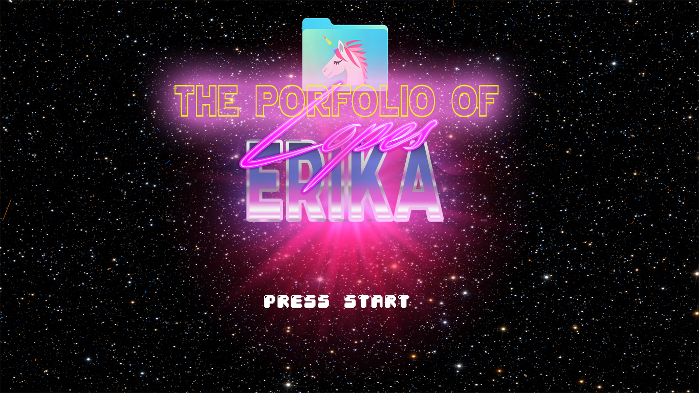

# Jekyll Theme Chirpy

# The Portfólio of @erikalopes 🦄

## JEKYLL RUN INSTALL 💉

* git clone https://github.com/erikalopes/portfolYOU.git
* cd portfolYOU
* bundle install
* bundle exec jekyll server 

